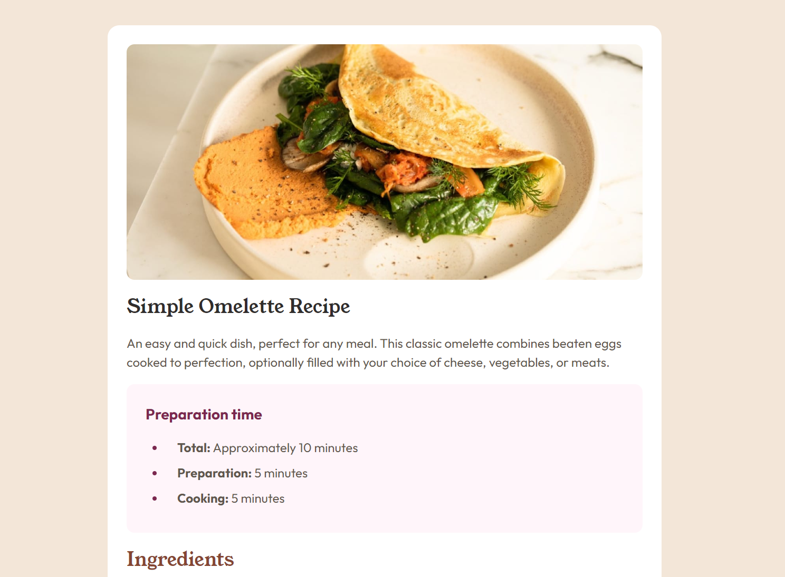

# Frontend Mentor - Recipe page solution

This is a solution to the [Recipe page challenge on Frontend Mentor](https://www.frontendmentor.io/challenges/recipe-page-KiTsR8QQKm). Frontend Mentor challenges help you improve your coding skills by building realistic projects.

## Table of contents

- [Overview](#overview)
  - [The challenge](#the-challenge)
  - [Screenshot](#screenshot)
  - [Links](#links)
- [My process](#my-process)
  - [Built with](#built-with)
  - [What I learned](#what-i-learned)
  - [Continued development](#continued-development)
  - [Useful resources](#useful-resources)
- [Author](#author)
- [Acknowledgments](#acknowledgments)

## Overview

### Screenshot

### Links

- Solution URL: [https://github.com/chloeandrie/recipe-page-main](https://github.com/chloeandrie/recipe-page-main)
- Live Site URL: [https://chloeandrie.github.io/recipe-page-main/](https://chloeandrie.github.io/recipe-page-main/)

## My process

### Built with

- Semantic HTML5 markup
- CSS custom properties
- Flexbox
- CSS Grid
- Mobile-first workflow

### What I learned

I have not used html tables frequently; I tend to gravitate to css flexbox or grid. In this case, an html table seemed appropriate for the nutrition section.

### Continued development

I'm hoping to continue to learn about using html tables and how best to use them while prioritizing accessibility.

### Useful resources

- [MDN](https://developer.mozilla.org/en-US/docs/Learn/CSS/Building_blocks/Styling_tables) - This helped me structure and style my html table. I really like this resource and will use it going forward.

## Author

- Frontend Mentor - [@chloeandrie](https://www.frontendmentor.io/profile/chloeandrie)

## Acknowledgments

Thank you Frontend Mentor for the inspiration for this project. These challenges are quickly becoming fun and addicting!
